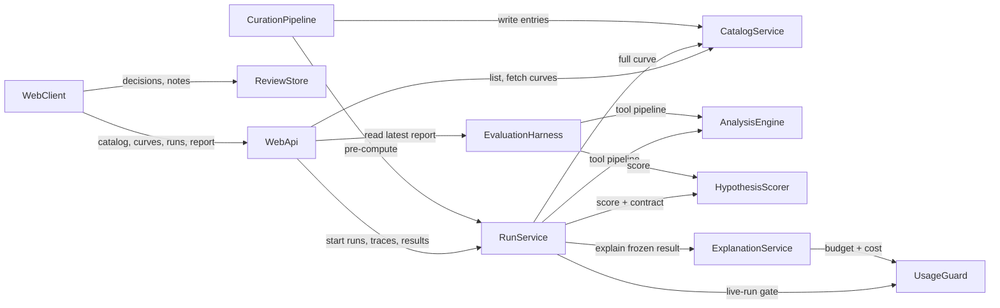

# Component Catalogue — OrbitSleuth

These are the logical building blocks of OrbitSleuth: code we write, not
infrastructure we deploy. Deployment topology is decided in Units
Generation. Tech stack and NFR patterns are decided in later stages.

## Catalogue

```yaml
components:
  - name: CatalogService
    summary: Serves the curated light-curve catalog and curve data with provenance.
    behaviour: >
      Holds 20-50 curated entries, each real or synthetic, with required provenance
      (archive + mission, or injected period/depth/noise). Validates target IDs at the
      boundary and rejects unknown or malformed IDs. Records a checksum per stored curve.
      Returns curves up to 70,000 points in full; larger curves get a display-downsampled
      series plus a notice, while analysis always receives the full data. Read-only for visitors.
    responsibilities:
      - Catalog manifest and entry lookup
      - Light-curve storage and retrieval with checksums
      - Display downsampling for oversized curves
      - Featured-example flag
    depends_on: []
    dependents:
      - component: WebApi
        interaction: list catalog entries and fetch curve data for visitors
      - component: RunService
        interaction: fetch the full curve for an analysis run
      - component: CurationPipeline
        interaction: write curated entries, provenance, and curves
    external_dependencies:
      - name: Curve and manifest store
        kind: object-store
        purpose: persist manifest and curve files (technology chosen later)
    entities:
      - name: CatalogEntry
        identifier: targetId
        attributes: [targetId, kind, provenance, featured, thumbnail, curveId]
        references:
          - entity: LightCurve
            owned_by: CatalogService
            relationship: each catalog entry points to one stored light curve
      - name: LightCurve
        identifier: curveId
        attributes: [curveId, time, flux, pointCount, checksum]

  - name: AnalysisEngine
    summary: Plain Python package of signal-processing tools; detrending, period search, vetting checks.
    behaviour: >
      Framework-free and deterministic: same input, parameters, and pipeline version give
      identical outputs at stored precision on the pinned platform. Tools: detrend,
      box-least-squares period search, vetting checks (depth, duration, SNR, odd/even depth,
      secondary eclipse, and on request harmonic P/2 and 2P plus a wider period search).
      Each check returns pass, fail, or not_run with a reason; a check below the
      minimum-transit threshold returns not_run. Failures raise typed domain errors, never
      null. Every tool output carries a unique toolOutputId so evidence can trace to it.
    responsibilities:
      - Detrending
      - Period detection (BLS)
      - Vetting checks, including extended checks for "request more evidence"
      - Pipeline version identity
    depends_on: []
    dependents:
      - component: RunService
        interaction: run the tool pipeline for a live or pre-computed analysis
      - component: EvaluationHarness
        interaction: run the tool pipeline over the frozen KOI sample
    external_dependencies: []
    entities:
      - name: ToolOutput
        identifier: toolOutputId
        attributes: [toolOutputId, tool, parameters, values, status, reason, durationMs]

  - name: HypothesisScorer
    summary: Turns tool outputs into four ranked, evidence-linked hypotheses under a strict output contract.
    behaviour: >
      Deterministic rule-based scoring for transit, eclipsing_binary, stellar_activity, noise.
      All four appear exactly once, sorted by descending confidence with a deterministic
      tie-break. Confidence is 0-100 inclusive; a hypothesis with missing, null, or empty
      evidence or an invalid confidence fails the output contract (TC-5). Every evidence item
      references a ToolOutput from the same run and carries its value (TC-4). A not_run check
      used by a hypothesis lowers its confidence and the penalty is named. Never emits a
      final or reviewed status; never uses the words "discovery" or "confirmed planet".
      Scoring thresholds are versioned with the pipeline.
    responsibilities:
      - Scoring and ranking the four categories
      - Evidence assembly with tool-output provenance
      - Output-contract validation (TC-4, TC-5)
    depends_on: []
    dependents:
      - component: RunService
        interaction: score tool outputs into the ranked result
      - component: EvaluationHarness
        interaction: score tool outputs for evaluation metrics
    external_dependencies: []
    entities:
      - name: Hypothesis
        identifier: hypothesisId
        attributes: [hypothesisId, category, confidence, rank, penalties]
        references:
          - entity: EvidenceItem
            owned_by: HypothesisScorer
            relationship: each hypothesis has one or more evidence items
      - name: EvidenceItem
        identifier: evidenceId
        attributes: [evidenceId, sourceToolOutputId, value, effect, added]
        references:
          - entity: ToolOutput
            owned_by: AnalysisEngine
            relationship: each evidence item traces to exactly one tool output

  - name: ExplanationService
    summary: Writes a plain-language explanation of a frozen result through a provider-neutral LLM port, with a runtime guard.
    behaviour: >
      Runs only after the ranked result is frozen and cannot modify it. Checks UsageGuard
      before each paid call and reports its estimated cost afterwards. Runtime guard: every
      number in the text must equal a tool-output value at displayed precision, and no
      forbidden term ("discovery", "discovered", "confirmed planet", case-insensitive, one
      shared list) may appear; on any guard failure, provider error, missing secret, or
      blocked budget the explanation is withheld and marked unavailable. Records which tool
      outputs it used. Secrets come from environment variables only.
    responsibilities:
      - Explanation generation via a swappable provider adapter
      - Runtime number and forbidden-term guard
      - Graceful "unavailable" degradation
    depends_on:
      - component: UsageGuard
        interaction: check budget before a paid call and record estimated cost after
        style: sync
    dependents:
      - component: RunService
        interaction: request an explanation for a frozen result
    external_dependencies:
      - name: LLM provider API
        kind: third-party-api
        purpose: generate explanation text (provider chosen later)
    entities:
      - name: Explanation
        identifier: explanationId
        attributes: [explanationId, runId, text, status, usedToolOutputIds, estimatedCost]
        references:
          - entity: AnalysisRun
            owned_by: RunService
            relationship: each explanation belongs to one analysis run

  - name: RunService
    summary: Orchestrates analysis runs and owns every run record, trace, and stored result.
    behaviour: >
      Creates a run ID per run and records pipeline version, input target, parameters, and
      source (live or pre-computed). Runs AnalysisEngine then HypothesisScorer, freezes the
      result, then requests an explanation. Emits trace steps in order with status, duration,
      and key inputs/outputs; on failure marks the failed step and every later step not_run
      and returns a structured failure distinct from a low-confidence result. Serves
      pre-computed results for curated curves and flags them stale when the pipeline version
      differs. Before a live run, consults UsageGuard; when blocked, serves the cached result
      or a resume-time notice. Re-runs and requests for more evidence create new runs and
      never alter earlier results. Every error is logged with its run ID.
    responsibilities:
      - Run lifecycle and run IDs
      - Trace recording and replay
      - Stored and cached results, staleness
      - Live-run gating via UsageGuard
    depends_on:
      - component: CatalogService
        interaction: fetch the full curve for the run
        style: sync
      - component: AnalysisEngine
        interaction: execute the tool pipeline
        style: sync
      - component: HypothesisScorer
        interaction: score and validate the result
        style: sync
      - component: ExplanationService
        interaction: request an explanation after the result is frozen
        style: sync
      - component: UsageGuard
        interaction: check and count live runs
        style: sync
    dependents:
      - component: WebApi
        interaction: start runs, stream or poll trace steps, fetch results by run ID
      - component: CurationPipeline
        interaction: pre-compute and store results for curated curves
    external_dependencies:
      - name: Run and result store
        kind: object-store
        purpose: persist run records, traces, and results (technology chosen later)
    entities:
      - name: AnalysisRun
        identifier: runId
        attributes: [runId, targetId, pipelineVersion, parameters, source, status, createdAt, stale]
        references:
          - entity: CatalogEntry
            owned_by: CatalogService
            relationship: each run analyses one catalog entry
          - entity: Hypothesis
            owned_by: HypothesisScorer
            relationship: each successful run holds four ranked hypotheses
      - name: TraceStep
        identifier: stepId
        attributes: [stepId, runId, order, name, status, durationMs, keyInputs, keyOutputs, reason]
        references:
          - entity: AnalysisRun
            owned_by: RunService
            relationship: each trace step belongs to one run
          - entity: ToolOutput
            owned_by: AnalysisEngine
            relationship: a tool step records the tool output it produced

  - name: UsageGuard
    summary: Enforces the per-visitor live-run limit, the daily spending cap, and the cost meter.
    behaviour: >
      Best-effort per-visitor limit (default 10 live runs per rolling 60 minutes, keyed by a
      hashed client IP or anonymous cookie, chosen in design). Only live runs count; serving
      a pre-computed result never does. Cost meter adds estimated tokens times configured unit
      price per paid call; spend equal to the cap blocks further live work for everyone until
      00:00 UTC. Uses an injectable clock. Fails fast at startup on missing or invalid limits.
      Holds state in a single local store (no cloud resources before Unit-of-Work approval).
    responsibilities:
      - Rate limiting of live runs
      - Daily spending cap and cost meter
      - Configuration validation
    depends_on: []
    dependents:
      - component: RunService
        interaction: check and count live runs
      - component: ExplanationService
        interaction: check budget and record cost of paid calls
    external_dependencies:
      - name: Local counter store
        kind: cache
        purpose: hold rate-limit counters and the daily spend ledger
    entities:
      - name: UsageCounter
        identifier: visitorKey
        attributes: [visitorKey, windowStart, liveRunCount]
      - name: SpendLedger
        identifier: day
        attributes: [day, spent, cap]

  - name: WebApi
    summary: The only translation boundary between the backend and the browser; validation, wire format, errors, health.
    behaviour: >
      Translates internal snake_case to camelCase on the wire using one shared schema and one
      shared category vocabulary. Validates every input (target IDs, parameters and ranges)
      and returns a single structured error shape with no stack traces; unknown or malformed
      IDs get a structured 4xx. Never computes scores or emits a final review status. Exposes
      a health endpoint and an error-rate counter; logs every request with its run ID where
      one exists. Serves the latest published evaluation report read-only.
    responsibilities:
      - HTTP boundary and wire contract
      - Input validation and structured errors
      - Health and error-rate signals, request logging
      - Read-only access to the latest evaluation report
    depends_on:
      - component: CatalogService
        interaction: list entries and fetch curves
        style: sync
      - component: RunService
        interaction: start runs, get trace steps and results
        style: sync
      - component: EvaluationHarness
        interaction: read the latest published evaluation report
        style: sync
    dependents:
      - component: WebClient
        interaction: all visitor data and actions
    external_dependencies: []
    entities: []

  - name: WebClient
    summary: The interactive browser app; Browser, Workspace (chart, hypothesis panel, trace), and About & accuracy views.
    behaviour: >
      Renders only what the API returns; never recomputes a score, detrends, or folds a curve.
      Implements all five screen states per view, WCAG 2.1 AA, and the three breakpoints per
      the refined mockups. Shows confidence as a labeled ranking score, evidence in
      Supports / Weakens / Not run groups, fixed glossary definitions for seven terms, and a
      collapsed "Adjust and re-run" form. Delegates every review decision and note to
      ReviewStore.
    responsibilities:
      - Views, navigation, and focus management
      - Chart rendering and interaction
      - Screen states, accessibility, responsive layout
      - Static glossary definitions
    depends_on:
      - component: WebApi
        interaction: fetch catalog, curves, runs, traces, and the evaluation report
        style: sync
      - component: ReviewStore
        interaction: read and change review decisions and notes
        style: sync
    dependents: []
    external_dependencies: []
    entities: []

  - name: ReviewStore
    summary: Browser-side store that alone owns review decisions and notes, and the only code that can make a hypothesis final.
    behaviour: >
      Status per (runId, category) is unreviewed by default; only the Accept and Reject
      handlers set accepted or rejected, and the latest human action wins, including Clear
      back to unreviewed (TC-6). Annotate, re-run, and request-more-evidence never change
      status. Notes are 1-2,000 Unicode code points, not empty or whitespace-only, stored and
      rendered as plain text. Persists in the visitor's browser only, keyed by run ID; if
      storage is unavailable it works for the session and reports that nothing will be kept.
    responsibilities:
      - Review decision state machine (TC-6 owner)
      - Notes with validation
      - Browser persistence keyed by run ID
    depends_on: []
    dependents:
      - component: WebClient
        interaction: read and change review decisions and notes
    external_dependencies:
      - name: Browser storage
        kind: other
        purpose: persist decisions and notes in the visitor's own browser
    entities:
      - name: ReviewDecision
        identifier: decisionKey
        attributes: [decisionKey, runId, category, status, decidedAt]
        references:
          - entity: AnalysisRun
            owned_by: RunService
            relationship: each decision concerns one run
          - entity: Hypothesis
            owned_by: HypothesisScorer
            relationship: each decision concerns one hypothesis of that run
      - name: Note
        identifier: noteId
        attributes: [noteId, runId, category, text, updatedAt]
        references:
          - entity: Hypothesis
            owned_by: HypothesisScorer
            relationship: each note is attached to one hypothesis

  - name: CurationPipeline
    summary: Offline author tool that builds the catalog; synthetic generation, real-curve fetch, and pre-computation.
    behaviour: >
      Command-line only; never exposed to visitors. Generates seeded synthetic curves (same
      seed and parameters give identical curves). Fetches the chosen real targets through an
      archive adapter; a failed target is listed with its reason and the run exits non-zero.
      Writes entries, provenance, and checksums to CatalogService, then pre-computes a result
      per entry through RunService so every stored result carries a run ID and pipeline version.
    responsibilities:
      - Synthetic-curve generation
      - Real-curve fetching via the archive adapter
      - Catalog population and pre-computation
    depends_on:
      - component: CatalogService
        interaction: write entries, provenance, and curves
        style: sync
      - component: RunService
        interaction: pre-compute and store results
        style: sync
    dependents: []
    external_dependencies:
      - name: Public light-curve archive
        kind: third-party-api
        purpose: source of real curves (archive selected by spike story US0.2)
    entities:
      - name: SyntheticSpec
        identifier: seed
        attributes: [seed, injectedPeriod, injectedDepth, noiseLevel, kind]

  - name: EvaluationHarness
    summary: Offline author tool that measures accuracy against a frozen, versioned KOI sample and publishes the baseline.
    behaviour: >
      Command-line only. Uses a versioned frozen sample of about 150 KOI targets with cached,
      checksummed curves and a versioned label-to-category mapping; labels that do not map
      cleanly count as unmapped, never dropped. Calls AnalysisEngine and HypothesisScorer
      directly and computes accuracy plus per-category precision and recall with the pipeline
      version and date. Same sample, cached curves, platform, and pipeline version give
      identical metrics. Excluded from the default pre-merge suite; a 3-row fixture exercises
      its logic pre-merge. Publishes the latest report for read-only display.
    responsibilities:
      - Frozen sample and label mapping
      - Metric computation
      - Report publication
    depends_on:
      - component: AnalysisEngine
        interaction: run the tool pipeline over the sample
        style: sync
      - component: HypothesisScorer
        interaction: score results for comparison with labels
        style: sync
    dependents:
      - component: WebApi
        interaction: read the latest published evaluation report
    external_dependencies:
      - name: NASA Exoplanet Archive KOI table
        kind: third-party-api
        purpose: labels and target list for the frozen sample (fetched once, then versioned)
    entities:
      - name: EvaluationSample
        identifier: sampleVersion
        attributes: [sampleVersion, targets, curveChecksums]
      - name: LabelMapping
        identifier: mappingVersion
        attributes: [mappingVersion, rules]
      - name: EvaluationReport
        identifier: reportId
        attributes: [reportId, pipelineVersion, sampleVersion, mappingVersion, runDate, accuracy, perCategory, unmappedCount]
        references:
          - entity: EvaluationSample
            owned_by: EvaluationHarness
            relationship: each report is computed over one sample version
```

## Component Diagram



Text fallback: WebClient calls WebApi and ReviewStore. WebApi calls
CatalogService, RunService, and EvaluationHarness (read-only report).
RunService calls CatalogService, AnalysisEngine, HypothesisScorer,
ExplanationService, and UsageGuard. ExplanationService calls UsageGuard.
CurationPipeline calls CatalogService and RunService. EvaluationHarness calls
AnalysisEngine and HypothesisScorer. There are no cycles.

## Component Summary

| Component | Purpose | Depends On | Dependents | Entities Owned |
|-----------|---------|------------|------------|----------------|
| CatalogService | Curated catalog and curve data | — | WebApi, RunService, CurationPipeline | CatalogEntry, LightCurve |
| AnalysisEngine | Signal-processing tools | — | RunService, EvaluationHarness | ToolOutput |
| HypothesisScorer | Ranking + evidence + output contract | — | RunService, EvaluationHarness | Hypothesis, EvidenceItem |
| ExplanationService | Guarded LLM explanation | UsageGuard | RunService | Explanation |
| RunService | Run lifecycle, traces, stored results | CatalogService, AnalysisEngine, HypothesisScorer, ExplanationService, UsageGuard | WebApi, CurationPipeline | AnalysisRun, TraceStep |
| UsageGuard | Rate limit, spend cap, cost meter | — | RunService, ExplanationService | UsageCounter, SpendLedger |
| WebApi | Wire boundary, validation, health | CatalogService, RunService, EvaluationHarness | WebClient | — |
| WebClient | Browser UI | WebApi, ReviewStore | — | — |
| ReviewStore | Review decisions and notes (TC-6) | — | WebClient | ReviewDecision, Note |
| CurationPipeline | Offline catalog build | CatalogService, RunService | — | SyntheticSpec |
| EvaluationHarness | Offline KOI evaluation | AnalysisEngine, HypothesisScorer | WebApi | EvaluationSample, LabelMapping, EvaluationReport |

## Entity Ownership

| Entity | Owning Component | Identifier | Attributes | References |
|--------|------------------|------------|------------|------------|
| CatalogEntry | CatalogService | targetId | targetId, kind, provenance, featured, thumbnail, curveId | LightCurve |
| LightCurve | CatalogService | curveId | curveId, time, flux, pointCount, checksum | — |
| ToolOutput | AnalysisEngine | toolOutputId | toolOutputId, tool, parameters, values, status, reason, durationMs | — |
| Hypothesis | HypothesisScorer | hypothesisId | hypothesisId, category, confidence, rank, penalties | EvidenceItem |
| EvidenceItem | HypothesisScorer | evidenceId | evidenceId, sourceToolOutputId, value, effect, added | ToolOutput (AnalysisEngine) |
| Explanation | ExplanationService | explanationId | explanationId, runId, text, status, usedToolOutputIds, estimatedCost | AnalysisRun (RunService) |
| AnalysisRun | RunService | runId | runId, targetId, pipelineVersion, parameters, source, status, createdAt, stale | CatalogEntry (CatalogService), Hypothesis (HypothesisScorer) |
| TraceStep | RunService | stepId | stepId, runId, order, name, status, durationMs, keyInputs, keyOutputs, reason | AnalysisRun, ToolOutput (AnalysisEngine) |
| UsageCounter | UsageGuard | visitorKey | visitorKey, windowStart, liveRunCount | — |
| SpendLedger | UsageGuard | day | day, spent, cap | — |
| ReviewDecision | ReviewStore | decisionKey | decisionKey, runId, category, status, decidedAt | AnalysisRun (RunService), Hypothesis (HypothesisScorer) |
| Note | ReviewStore | noteId | noteId, runId, category, text, updatedAt | Hypothesis (HypothesisScorer) |
| SyntheticSpec | CurationPipeline | seed | seed, injectedPeriod, injectedDepth, noiseLevel, kind | — |
| EvaluationSample | EvaluationHarness | sampleVersion | sampleVersion, targets, curveChecksums | — |
| LabelMapping | EvaluationHarness | mappingVersion | mappingVersion, rules | — |
| EvaluationReport | EvaluationHarness | reportId | reportId, pipelineVersion, sampleVersion, mappingVersion, runDate, accuracy, perCategory, unmappedCount | EvaluationSample |

## External Dependencies

| Component | Dependency | Kind | Purpose |
|-----------|------------|------|---------|
| CatalogService | Curve and manifest store | object-store | Persist manifest and curves |
| RunService | Run and result store | object-store | Persist runs, traces, results |
| ExplanationService | LLM provider API | third-party-api | Explanation text |
| UsageGuard | Local counter store | cache | Rate-limit counters and spend ledger |
| ReviewStore | Browser storage | other | Visitor-local decisions and notes |
| CurationPipeline | Public light-curve archive | third-party-api | Real curves (selected by US0.2) |
| EvaluationHarness | NASA Exoplanet Archive KOI table | third-party-api | Labels and target list, fetched once then versioned |

## Rationale

| Component | Why it is a separate building block |
|-----------|------------------------------------|
| CatalogService | Distinct data ownership (catalog and curves). It is read-only for visitors and changes only at curation time. |
| AnalysisEngine | A framework-free scientific core with the slowest change rate. It is tested fixtures-first, in isolation [practices]. |
| HypothesisScorer | Distinct change rate: thresholds are tuned against the evaluation. It is the single home of the TC-4/TC-5 contract (ADR-001). |
| ExplanationService | An external, paid, non-deterministic dependency behind a port, with its own guard and degradation (ADR-004). |
| RunService | The single owner of run identity, traces, and results, for both live and pre-computed runs (ADR-005). |
| UsageGuard | A cross-cutting cost and safety policy shared by two callers, testable with an injectable clock (ADR-006). |
| WebApi | The only translation boundary between the backend and the wire [practices] (ADR-007). |
| WebClient | A distinct runtime (the browser) and a distinct concern (presentation and accessibility). |
| ReviewStore | The sole owner of the "final" transition (TC-6). It lives where the data lives, in the browser (ADR-002). |
| CurationPipeline | Author-only, offline, and never exposed (ADR-003). |
| EvaluationHarness | Author-only, offline, and reproducible. Its report is published read-only (ADR-003). |

### Alternatives Rejected (summary)

These are detailed in `decisions.md`:

- Scoring merged into the engine (ADR-001).
- A backend-validated review status (ADR-002).
- Admin features inside the public service (ADR-003).
- Explanation as a step inside run orchestration (ADR-004).
- The catalog owning pre-computed results (ADR-005).
- Limits embedded in API handlers (ADR-006).

## Sources

- [requirements] `inception/requirements-analysis/requirements.md`
- [stories] `inception/user-stories/stories.md`
- [mockups] `inception/refined-mockups/mockups.md`, `interaction-spec.md`
- [practices] `inception/practices-discovery/team-practices.md`
- [Q1]–[Q6] `inception/domain-design/domain-design-questions.md`

## Assumptions & Open Questions

- [assumption] The storage technology for the curve, manifest, run, and result stores and the local counter store is chosen in NFR and infrastructure design; the ownership here holds for any choice.
- Open: which archive supplies real curves, decided by spike story US0.2 (see also the project correction on verifying data sources).
- Open: how the rate-limit visitor key is derived (hashed IP or cookie), decided in functional design.
- Open: how trace steps are delivered to the browser (polling, SSE, or WebSocket), decided in contract design.
