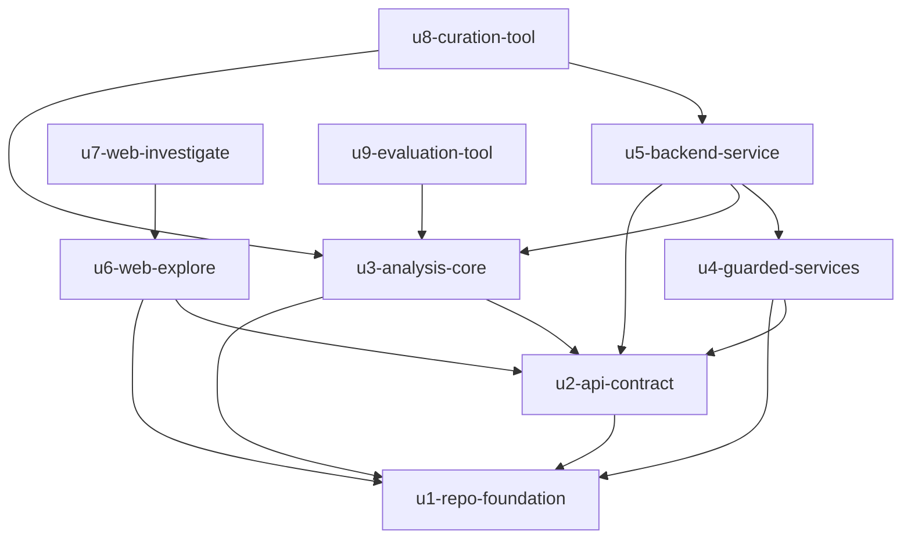

# Unit Dependencies — OrbitSleuth

This document describes topology only. It does not recommend a build order
or identify a critical path; those are chosen in Delivery Planning.

## Edge Block

```yaml
units:
  - name: u1-repo-foundation
    kind: packaging
    depends_on: []
  - name: u2-api-contract
    kind: spec
    depends_on: [u1-repo-foundation]
  - name: u3-analysis-core
    kind: library
    depends_on: [u1-repo-foundation, u2-api-contract]
  - name: u4-guarded-services
    kind: library
    depends_on: [u1-repo-foundation, u2-api-contract]
  - name: u5-backend-service
    kind: service
    depends_on: [u2-api-contract, u3-analysis-core, u4-guarded-services]
  - name: u6-web-explore
    kind: ui
    depends_on: [u1-repo-foundation, u2-api-contract]
  - name: u7-web-investigate
    kind: ui
    depends_on: [u6-web-explore]
  - name: u8-curation-tool
    kind: packaging
    depends_on: [u3-analysis-core, u5-backend-service]
  - name: u9-evaluation-tool
    kind: library
    depends_on: [u3-analysis-core]
```

## Dependency Diagram



Arrows read "depends on". The graph has no cycles.

## Integration Points

| From | To | Integration | What crosses |
|------|----|-------------|--------------|
| U2 | U1 | Build config | Schema lives in the repo; lint and CI cover it |
| U3 | U2 | Shared schema (published language) | Hypothesis, evidence, and tool-output shapes the API serializes |
| U4 | U2 | Shared schema | Explanation and usage-limit notice shapes |
| U5 | U3 | In-process library call | Curve in; tool outputs and ranked, contract-validated result out |
| U5 | U4 | In-process library call | Explanation requests; live-run and budget checks |
| U5 | U2 | Implements the contract | HTTP endpoints and camelCase payloads |
| U5 | U8, U9 outputs | Versioned data files read at startup | Catalog manifest, curves, pre-computed results, evaluation report |
| U6 | U2 | Consumes the contract over HTTP | Catalog, curves, report |
| U7 | U6 | Embedded in the U6 app shell and routes | Workspace layout, chart, focus handling |
| U7 | U2 (via U6's API client) | HTTP | Runs, trace steps, results |
| U8 | U3, U5 | In-process import | Engine and RunService code for pre-computation; writes data files |
| U9 | U3 | In-process import | Engine and scorer over the frozen sample; writes the report file |

## Parallel Development Opportunities

Sets of units with no dependency between them:

- {U3, U4, U6}: all need only U1 and U2.
- {U7, U5}: independent of each other. U7 needs U6; U5 needs U3 and U4.
  U7 can be developed against a mocked API from the U2 contract.
- {U9, U4, U5, U6, U7}: U9 needs only U3.
- {U8, U7, U9}: U8 needs U3 and U5.

Many valid topological orderings exist. Delivery Planning picks one.

## Sources

- `inception/units-generation/unit-of-work.md`
- `inception/domain-design/components.md` (component `depends_on` edges)
- [Q4], [Q5] `inception/units-generation/units-generation-questions.md`

## Assumptions & Open Questions

- [assumption] Spike US0.2 (U8) informs U9's archive access. This is
  modeled as a scheduling note for Delivery Planning, not a code edge (see
  `unit-of-work.md`).
